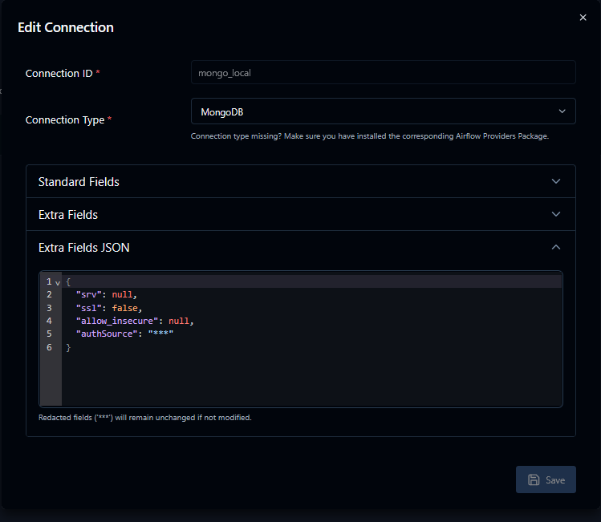
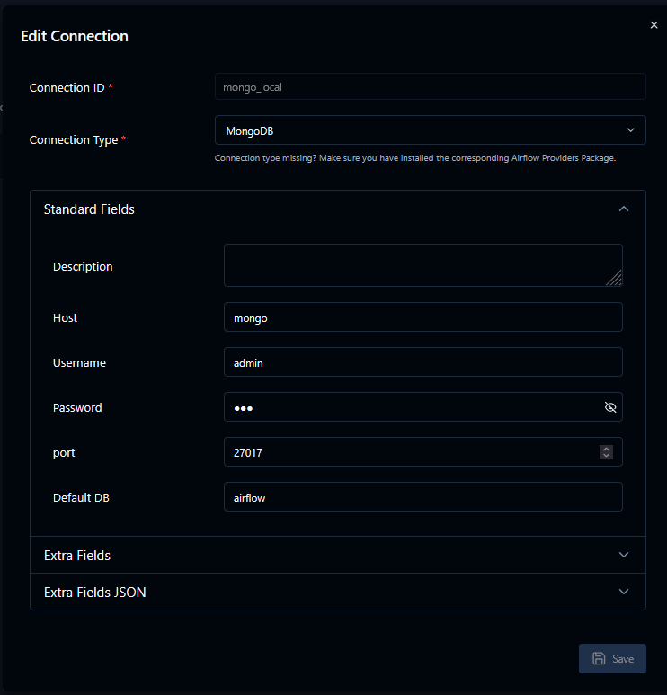
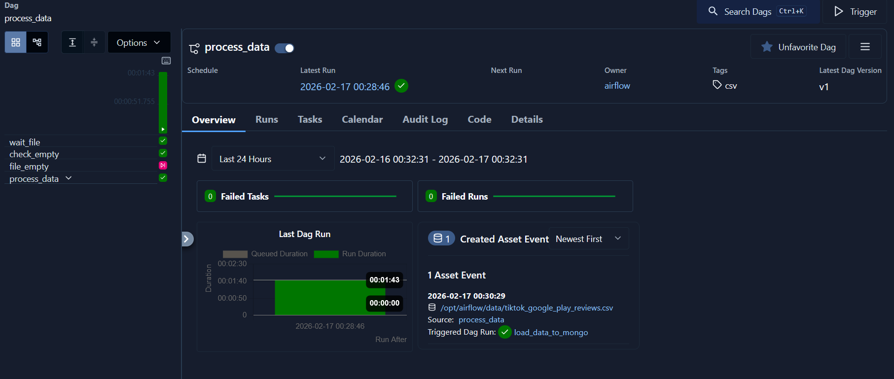
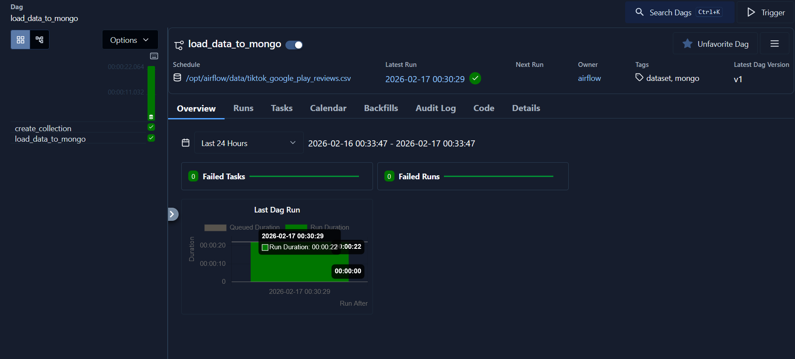
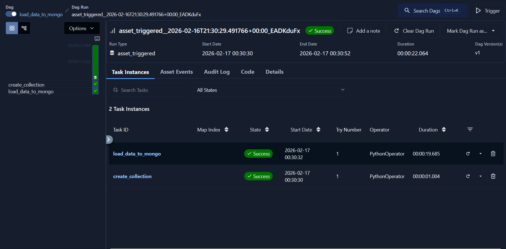
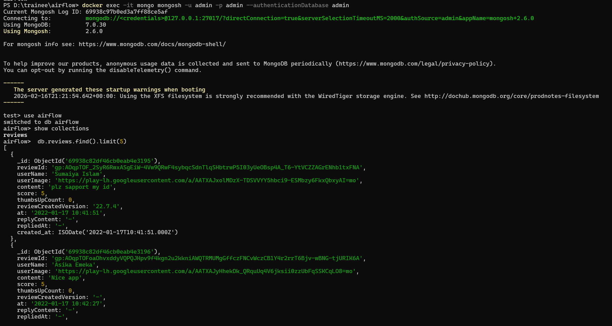
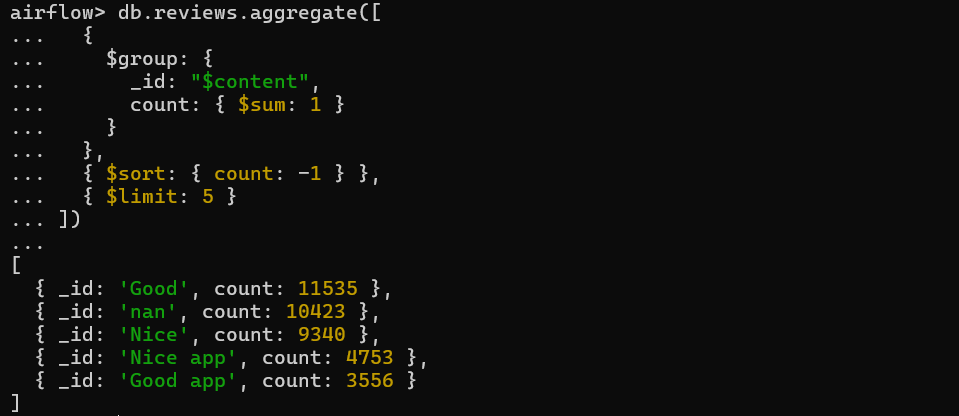
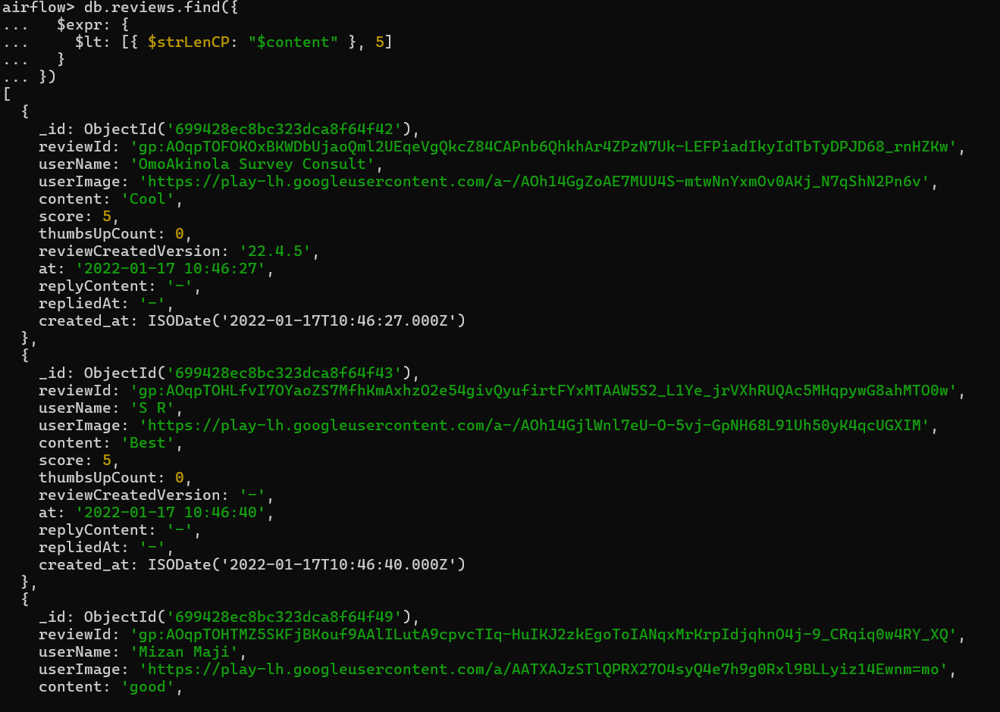
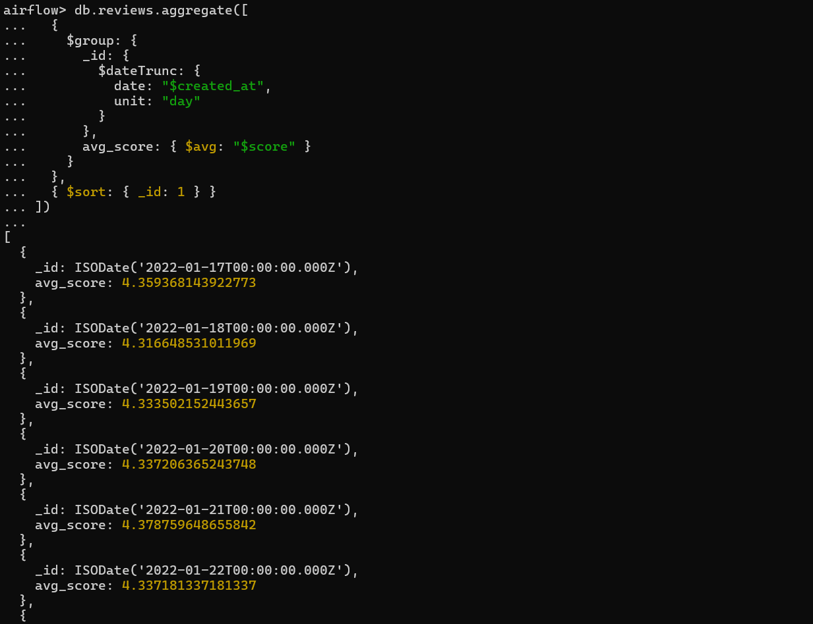

## Configuration of airflow connection for MongoHook


-----
## Execution of the first DAG


-----
## ## Execution of the second DAG


------
## Data appeared in MongoDB

------
## Query 1
```javascript
db.reviews.aggregate([
  {
    $group: {
      _id: "$content",
      count: { $sum: 1 }
    }
  },
  { $sort: { count: -1 } },
  { $limit: 5 }
])
```

------
## Query 2
```javascript
db.reviews.find({
  $expr: {
    $lt: [{ $strLenCP: "$content" }, 5]
  }
})
```

------
## Query 3
```javascript
db.reviews.aggregate([
  {
    $group: {
      _id: {
        $dateTrunc: {
          date: "$created_at",
          unit: "day"
        }
      },
      avg_score: { $avg: "$score" }
    }
  },
  { $sort: { _id: 1 } }
])
```

------